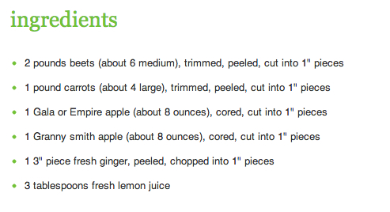

<!--
To compile this document
graphics.off();rm(list=ls());rmarkdown::render('Tutorial_HTM_2016.Rmd');purl('Tutorial_HTM_2016.Rmd')
pdf document
rmarkdown::render('Tutorial_HTM_2016.Rmd', BiocStyle::pdf_document())
-->

```{r options, include=FALSE}
library(knitr)
options(digits=3, width=80)
opts_chunk$set(echo=TRUE,tidy=FALSE,include=TRUE,
               dev='png', fig.width = 6, fig.height = 3.5, comment = '  ', dpi = 300,
cache = TRUE)
```


# Required packages and other preparations

```{r get-patched-cellh5, eval=FALSE, include=FALSE}
## this code chunk is disabled from running and displaying
## run in case you need to install/update the 'cellh5' package
devtools::install_github("CellH5/cellh5-R")
```

```{r required_packages_and_data, echo = TRUE, message=FALSE}
library(rmarkdown)
library(tidyverse)
library(openxlsx)
library(cellh5)
library(psych)
library(stringr)
library(splots)
```

# About the tutorial

In this tutorial, we will import a single plate from a high content screen performed
on 96 well plates. The input data that we are going to use are class labels for 
each single cell. These classification results have been obtained using a machine 
learning alogrithm based on the original image features. The data produced is similar
to the one in @Neumann_2010.

<!--  -->

# Annotation import

We first import the annotation of the plate. This consists of table that informs
us about the content of every single well on the plate.

```{r import_annotation}
data_path <- "~/p12_data"
plate_map <- read.xlsx(xlsxFile = file.path(data_path, "plate_mapping.xlsx"))
head(plate_map)
```


# Importing the raw data

We will now import the raw data. This data is stored in a variant of the [HDF5 format](https://en.wikipedia.org/wiki/Hierarchical_Data_Format) called
"[CellH5]"(http://www.cellh5.org/),
which defines a more restricted sub-format designed specificially to store data
from hight content screens. More information can be found in the paper by 
@Sommer_2013.

In the code below, we use the [cellh5](https://github.com/CellH5/cellh5-R) R--package 
to import the data. The file `_all_positions.ch5` contains links to the other `ch5`
files that contain the full data of the plate. 
We are only interested in the predictions produced 
by the machine learning algorithm, so we only extract this part of the file.


```{r readCellH5, dependson="plate_map", eval=FALSE}
path <- file.path(data_path, "_all_positions.ch5")
c5f <- CellH5(path)
c5_pos <- C5Positions(c5f, C5Plates(c5f))
predictions <- C5Predictions(c5f, c5_pos[[1]], mask = "primary__primary3", as = "name")

c5_pos[["WB08_P1"]] <- NULL

```


# Tabulate the raw data

We now tabulate the raw data: we compute how many cells are assigned to each 
class for each well. The result is a data matrix, which contains the wells of
the screen plate in the columns and the counts for the respective classes in the
rows.

This is a typical example of a "wide" data table, where the variables 
contained in the data set spread across multiple columns. 

```{r import_data_table, dependson="readCellH5", eval=FALSE}

raw_data <- sapply(c5_pos, function(pos){
                predictions <- C5Predictions(c5f, pos, mask = "primary__primary3", as = "name")
                table(predictions)}
               )                     
save(raw_data, file = "raw_data.RData")

head(raw_data)

```


# The concept of tidy data

In a nutshell, a  dataset is a collection of values, usually either numbers
(if quantitative) or strings (if qualitative). Values are organized in two ways:
Every value belongs to a variable and an observation.

A variable 
contains all values that measure the same underlying attribute 
(like height, temperature, duration) across units.  An observation 
contains all values measured on the same unit (like a person, or a day, 
or a race) across attributes.

Now, a tidy data frame now organizes the data in such a way that
each observation corresponds to an single line in the data set. This representation
is often refered to as a "long" data tables.

In general, a long data table is  the most appropriate format for 
downstream analysis, although a wide representation is better for viewing 
the data. For a thorough discussion of this topic see the paper by
Hadley @greycite53870.

In any case, we often need to move between the different shapes. The 
`r CRANpkg("tidyr")` has two main functions that allows us to go back and forth:

*`gather()` takes multiple columns, and gathers them 
into key--value pairs: it  makes  "wide" data longer.

*`spread()` takes two columns (key \& value) and
spreads into multiple columns, it makes "long" data wider.


# Reshaping the screen data and joining the plate annotation

We now reshape the input data, which is in a long format into a wide format.
For this, we first turn the row names into an explicit column and then gather
all the columns representing wells.

The result is a "long" data table, which contains one observation per row: in our 
case the number of times a cell was assigned to a specific class in every single
well. Class in combination with well serve as our "key" here, and the class--count
is the associated value.

We now want to join the annotation to this data table in the long format. Before
we can do this however, we need to solve a subtle problem: Our well identifiers
in the imported data are different from the identifiers in the annotation table
so we cannot easily join the two tables togehter. 

We first need to strip the lead "W" from the well identifiers and replace the 
"P1" suffix by a "01" suffix. We do this by using a regular expression. Regular
expressions are a powerful tool for the handling of strings and one can find
a nice tutorial about them here: [regex tutorial](http://www.zytrax.com/tech/web/regex.htm).

We can now join the annotation to our long table and use the well as the joining
key.

```{r reshape, dependson="import_data_table"}
load("raw_data.RData")

tidy_raw_data  <- rownames_to_column(as.data.frame(raw_data), var = "class") %>%
                   gather(key = "well", value = "count", WA01_P1:WC07_P1)

sample_n(tidy_raw_data, 6)

tidy_raw_data$well <- str_replace(tidy_raw_data$well, "^W([A-H][0-9]{2})_P1", "\\1_01")

#join annotation

input_data <- left_join(tidy_raw_data, plate_map, by = c("well" = "Position"))

sample_n(input_data, 6)
```

# Plotting in R: ggplot2

`r CRANpkg("ggplot2") ` is a package by Hadley Wickham 
that implements the idea of __grammar of graphics__:  There is a grammar 
to the composition of graphical components in  and by directly controlling that 
grammar, you can generate  a large set of graphics 
tailored to your particular needs. 

The central concept of the approach is that 
plots convey information through various aspects of their aesthetics.
Aesthetics are mappings from the data to something you can visually perceive.
Some aesthetics that plots use are:


* x position
* y position
* size of elements
* shape of elements
* color of elements


The elements in a plot are geometric shapes, like

* points
* lines
* line segments
* bars
* text


Comprehensive documentation for the package can
be found [on its website](http://ggplot2.org).  The online documentation includes
example use cases for a lot of the graphic types  and is an invaluable resource 
when creating figures.

In `r CRANpkg("ggplot2") ` each component is added to the plot as a layer, 
hence you might start with 
a simple mapping of the raw data to the x-- and y--axes, creating a scatterplot.
A second layer may the be added by coloring the points according to a
group they belong to and so on.


The values represented in the plot are the product of various statistics.
If you just plot the 
raw data, you can think of each point representing the identity statistic. 

Bar charts however, often represent the mean or a count statistic, while 
histograms are bar charts where the bars represent the binned count or density 
statistics and so on.

Let's start by  creating a simple plot: Data from an
enzyme-linked immunosorbent assay (ELISA) assay. The assay was used to quantify the
activity of the enzyme deoxyribonuclease (DNase), which degrades DNA. The data are
assembled in the R object `DNase`, which conveniently comes with base R.
`DNase` is a dataframe whose columns are `Run`, the assay run;
`conc`, the protein concentration that was used; and `density`, the
measured optical density.

```{r figredobasicplottingwithggplot, fig.width = 3.5, fig.height = 5}
ggplot(DNase, aes(x = conc, y = density, color = Run)) + geom_point() 
```

We just wrote our first `sentence` using the grammar of graphics. 
Let us deconstruct this sentence.
First, we specified the dataframe that contains the data, `DNase`.
Then we told `ggplot` via the aesthetics `aes` argument which variables 
we want on the $x$- and $y$-axes, respectively and mapped the run number 
to the color aesthetic.
Finally, we stated that we want the plot to use points, by adding the result 
of calling the function `geom\_point`. 


# Principal component analysis (PCA) to for data visualization

PCA is primarily an exploratory technique which produces
maps that show the relations between the variables and between observations in a
useful way. It procedes by computing principal components of the original data, 
which are _linear combinations_ of the variables originally measured.

To understand what a linear combination
really is, we can take an analogy, when making a healthy juice
mix, you can follow a recipe.




$$
V=2\times \mbox{ Beets }+ 1\times \mbox{Carrots } +\frac{1}{2} \mbox{ Gala}+ \frac{1}{2} \mbox{ GrannySmith}
+0.02\times \mbox{ Ginger} +0.25 \mbox{ Lemon }
$$
This recipe is a linear combination of individual juice types (the
original
variables). The result is a new variable $V$, the coefficients
$(2,1,\frac{1}{2},\frac{1}{2},0.02,0.25)$
 are called the _loadings_.
 
A linear combination of variables defines a line in higher dimensions in the same way
as e.g. a simple linear regression defines a line in the scatterplot plane of two dimensions. 

There are many ways to choose lines onto which we project the data. 
PCA chooses the line in such a way that the distance of the data points
to the line is minimized, and the variance of the orthogonal projections 
of the data points along the line is maximized.

Spreading points out to maximize the variance of the projected points will show
more 'information'. 

For computing multiple axes, PCA finds the axis showing the largest variability,
removing the variability in that direction and then iterating to find 
the next best orthogonal axis so on. 

# Using ggplot to create a PCA plot for the data


Before we can compute a PCA, we have to make sure that the variables that
we have obtained for every single well  are normalized. As our data consists
of the number of cells each phenotypic category a straigforward normalization 
consits of transforming the counts into percentages by dividing the data
for each well by its total number of cells.

## The chaining operator

For this, we use the chaining (or piping) operator `%>%`. 
$x \% \textgreater \% f(y) $ is simply $f(x, y)$, so one can use
it to rewrite multiple operations in such a way that they can be read
from you can read from left--to--right,
top--to--bottom. A simple example will make that clear: We create 
two vectors and calculate Euclidian distance between them. Instead of
the usual way:

```{r chainingSimpleExample_1}
x1 <- 1:5; x2 <- 2:6
sqrt(sum((x1-x2)^2))
```

We can use the piping operatror

```{r chainingSimpleExample_2}
(x1-x2)^2 %>%
sum() %>%
sqrt()
```

Which makes the set of operations much easier to digest and understand.

## Grouping, summarizing and data transformation

Having tidy data frames, we can employ  a __split--apply--combine__
strategy for data analysis. What this means is that wer first group our 
individual observations by one or more factors (_split_ operation), then 
_apply_ computations to each group and then combine the results into new
data frame that contains one line per group

In the code chunk below, we  use the`group\_by()` function 
to splot the  dataset into groups according to the well ID. 
We then apply the function `sum()` to the counts of each well and
use`summarize()` to obtain a table of counts per well.


We can now join the table containing the sums to the original
data and compute compute percentage using the sums.

As PCA works best on data that is on normal distribution  (z--score) scale,
we perform at [logit](https://en.wikipedia.org/wiki/Logit) transformation 
to turn the percentages
into z--scores. This is similar in spirit to a log transformation on
intensity values.


```{r grouping_and_summarizing, dependson="reshape"}

no_cells_per_well <- input_data %>%
                    group_by(well) %>%
                    summarize(no_cells = sum(count))

head(no_cells_per_well)

data_with_sums <-  left_join(input_data, no_cells_per_well)

data_for_PCA <- mutate(data_with_sums, perc = count / no_cells, 
                       z_score = logit(perc))

head(data_for_PCA)
```

## creating the PCA plot using ggplot2

We are now ready to create the PCA plot. For this, we first need to turn
the input data into a wide data frame again by spreading the z--scores across
columns.

We can then use the function `prcomp()` to compute the actual principal components.
We also create a vector genes, giving us the gene each of our siRNAs is targeting.

We then create a ggplot object by mapping the first principal component to the 
x-- and the second one to the y--axis. We use the gene names as plotting symbols
and  color the names according to to the gene name (As we have multiple empty wells
as well as multiple siRNAs targeting the same gene).

Furthemore, we specify that the aspect ratio of x and y axis should be equal to 
the ratio of the variance explained by PC1 to the variance explained by PC2 so
that the axes represent the same units. This facilitates a correct interpretation 
of the PCA plot: PC1 has more variance than PC2, so the x--axis should 
be longer than the y--axis to reflect the differences in scale.


```{r PCA, dependson="grouping_and_summarizing"}
data_for_PCA <- data_for_PCA %>% 
                dplyr::select(class, well, z_score) %>%
                spread(key = class, value = z_score)


PCA <- prcomp(data_for_PCA[, -1], center = TRUE, scale. = TRUE)


genes <- input_data %>%
         group_by(well) %>%
        dplyr::summarize(gene = unique(Gene.Symbol))

genes <- ifelse(is.na(genes$gene), "empty", genes$gene)

dataGG = data.frame(PC1 = PCA$x[,1], PC2 = PCA$x[,2],
                    PC3 = PCA$x[,3], PC4 = PCA$x[,4],
                    genes)

pl <- (ggplot(dataGG, aes(x = PC1, 
                 y = PC2, color =  genes))
      + geom_text(aes(label = genes), size = I(4))
      + coord_fixed(ratio = (PCA$sdev^2)[2] / (PCA$sdev^2)[1])
      + ggtitle("Principal components plot")
    )

pl
```

We can see that the control wells cluster together. Note that it is easy to turn
this plot into an interactive version using `ggplotly` from the `r CRANpkg("plotly")`.


# Plate heatmap of apoptosis proportions

Heatmaps are a powerful of visualising large, matrix-like datasets and giving a quick
overview over the patterns that might be in there. There are a number of heatmap drawing
functions in R; one that is convenient and produces good-looking output is the function
`pheatmap` from the eponymous package. 

However, here we will use ggplot to create the heatmap. We first join all the
well IDs to the data, so that we can plot missing values in a uniform fashion.

Then we extract the row (letters) and column (numbers) from the well ID and
finally map the rows to the y--axis, the columns to the x--axis and the color
fill to the percentage values for apoptosis

The heatmap plot shows that well A08 contains a high percentage of apoptic
cells compared to the other wells.

```{r heatmap_apoptosis}

dat_rows = toupper(letters[1:8])
dat_cols = c(paste0("0",seq(1:9)),seq(10,12))
wells <- data.frame( well = paste0(outer(dat_rows, dat_cols, paste0), "_01"))

data_for_heatmap <- arrange(full_join(data_for_PCA, wells), well) %>%
                    select(well, Apoptosis) %>%
                    extract(well, into = c("row", "column"), 
                            regex = "([A-Z])([0-9]{2})", remove = FALSE) %>%
                    mutate(perc_apoptosis = logistic(Apoptosis)) %>%
                    mutate(row = factor(row, 
                           levels = sort(unique(row), decreasing = TRUE)))

theme_set(theme_bw())       
heatmap <- (ggplot(data_for_heatmap, aes(column, row))
          + geom_tile(aes(fill = perc_apoptosis))
          + scale_fill_distiller(type = "seq", palette = "RdYlBu"))

heatmap
```


# Session information

```{r seesionInfo, results='markup'}
sessionInfo()
```


# References


